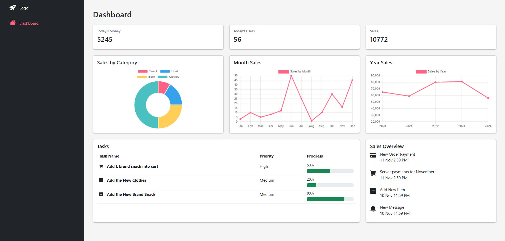

# Simple Dashboard
## 1. Project Overview
#### This project is a single-page dashboard showcasing key UI elements.

## 2. Features
#### Overview of sales metrics
#### Interactive chart
#### Tabulated data display

## 4. Tools
#### UI Design: Figma
#### Development: HTML, CSS, JavaScript, Bootstrap

## 5. Screenshot
#### 

## 6. Figma Design
You can view the Figma design for this project here: [Figma Design]([https://www.figma.com/file/yourfilelink](https://www.figma.com/design/bfy29er5g0E8VNw9ClgU1v/Dashboard?node-id=0-1&t=YoM2rfiP6O91DDrK-1))

